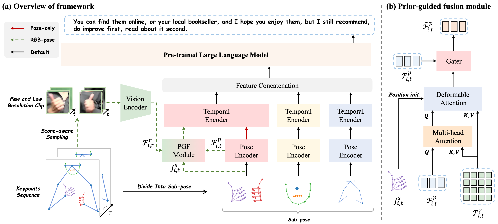

<h3 align="center"><a href="" style="color:#9C276A">
Uni-Sign: Toward Unified Sign Language Understanding at Scale</a></h3>
<h5 align="center"> 
If our project helps you, please give us a star🌟 on GitHub, that would motivate us a lot!
</h2>

<h5 align="center">

[](https://arxiv.org/abs/2501.15187) 
[](https://huggingface.co/datasets/ZechengLi19/CSL-News)
[](https://pan.baidu.com/s/17W6kIreNMHYtD4y2llKmDg?pwd=ncvo) 

[](https://paperswithcode.com/sota/sign-language-recognition-on-ms-asl?p=uni-sign-toward-unified-sign-language)
[](https://paperswithcode.com/sota/sign-language-recognition-on-wlasl100?p=uni-sign-toward-unified-sign-language)
[](https://paperswithcode.com/sota/sign-language-recognition-on-wlasl-2000?p=uni-sign-toward-unified-sign-language)
[](https://paperswithcode.com/sota/sign-language-recognition-on-csl-daily?p=uni-sign-toward-unified-sign-language)
[](https://paperswithcode.com/sota/gloss-free-sign-language-translation-on-csl?p=uni-sign-toward-unified-sign-language)
[](https://paperswithcode.com/sota/gloss-free-sign-language-translation-on-2?p=uni-sign-toward-unified-sign-language)
[](https://paperswithcode.com/sota/gloss-free-sign-language-translation-on-3?p=uni-sign-toward-unified-sign-language)
</h5>



## 💥 News
[2025/1/25] This [paper](https://openreview.net/pdf?id=0Xt7uT04cQ) is accepted by `ICLR 2025` 🎉🎉!

[2025/2/24] Release CSL-News dataset and code implementation.

## 🛠️ Installation
We suggest to create a new conda environment. 
```bash
# create environment
conda create --name Uni-Sign python=3.9
conda activate Uni-Sign
# install other relevant dependencies
pip install -r requirements.txt
```

## 📖 Preparation
Please follow the instructions provided in [DATASET.md](./docs/DATASET.md) for data preparation.

## 🔨 Training & Evaluation
All scripts must be executed within the Uni-Sign directory.
### Training
**Stage 1**: pose-only pre-training.
```bash
bash ./script/train_stage1.sh
```
**Stage 2**: RGB-pose pre-training.
```bash
bash ./script/train_stage2.sh
```
**Stage 3**: downstream fine-tuning.
```bash
bash ./script/train_stage3.sh
```

### Evaluation
After completing stage 3 fine-tuning, performance evaluation on a single GPU can be performed using the following command:
```bash
bash ./script/eval_stage3.sh
```

## 👨‍💻 Todo
- [x] Release CSL-News dataset
- [x] Release Uni-Sign implementation 

## 📮 Contact
If you have any questions, please feel free to contact Zecheng Li (lizecheng19@gmail.com). Thank you.

## 👍 Acknowledgement
The codebase of Uni-Sign is adapted from [GFSLT-VLP](https://github.com/zhoubenjia/GFSLT-VLP). We are also grateful for the following projects our Uni-Sign arise from:
* 🤟[SSVP-SLT](https://github.com/facebookresearch/ssvp_slt): a excellent sign language translation framework! 
* 🏃️[MMPose](https://github.com/open-mmlab/mmpose): an open-source toolbox for pose estimation.
* 🤠[FUNASR](https://github.com/modelscope/FunASR): a high-performance speech-to-text toolkit.


## 📑 Citation
If you find Uni-Sign useful for your research and applications, please cite using this BibTeX:
```
@article{li2025uni,
  title={Uni-Sign: Toward Unified Sign Language Understanding at Scale},
  author={Li, Zecheng and Zhou, Wengang and Zhao, Weichao and Wu, Kepeng and Hu, Hezhen and Li, Houqiang},
  journal={arXiv preprint arXiv:2501.15187},
  year={2025}
}
```